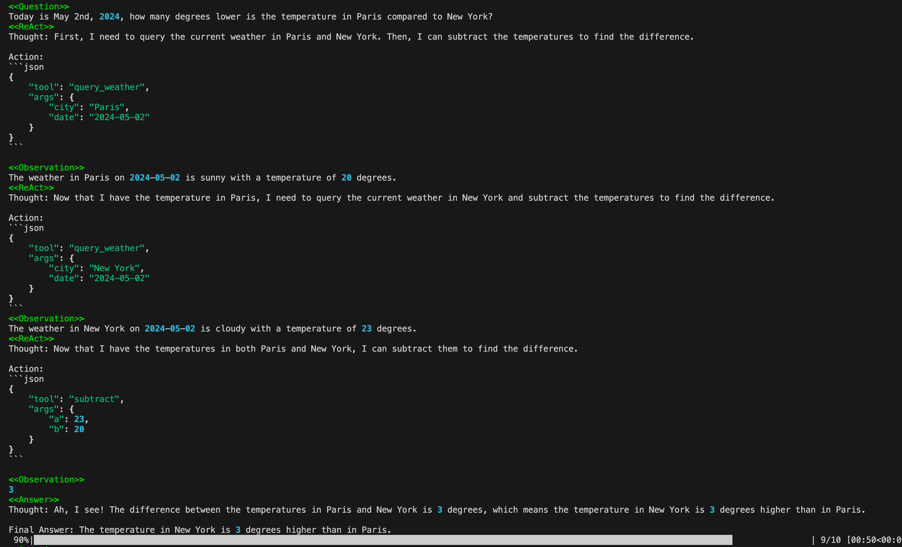
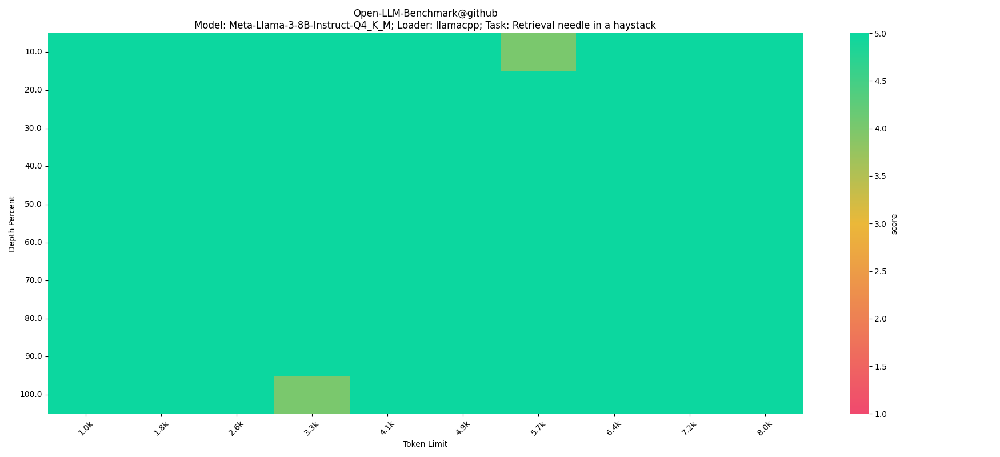
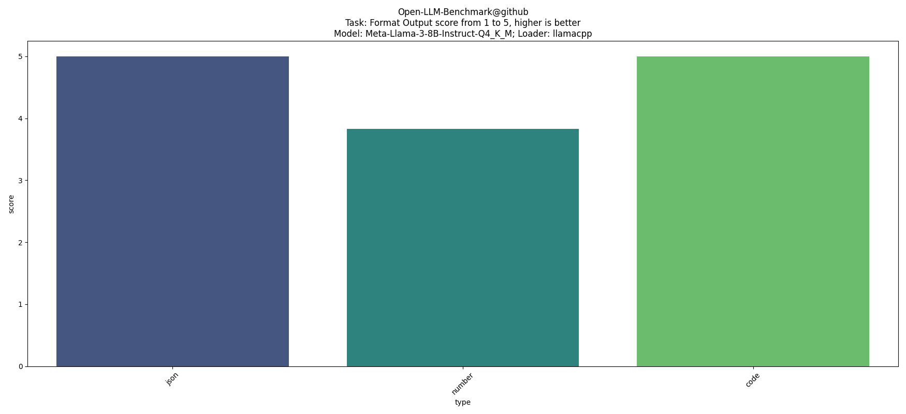

# 🚀open-souce LLMs benchmark

Evaluate the capabilities of open-source LLMs in agent, tool calling, formatted output, long context retrieval, multilingual support, coding, mathematics, and custom tasks.

## Example

### 🤖Agent Tasak

The ReAct Agent can access 5 functions. There are 10 questions to be solved, 4 of which are simple questions that can be solved using a single function, and 6 of which are complicated questions that require the agent to use multiple steps to solve. 

The score ranges from 1 to 5, with 5 representing complete correctness. Here is an screen shot while running evaluation.



### 🧐Retrieval Task

Insert the needle(answer) into a haystack(long context) and ask the model **retrieval** the question based on the long context.



### 🗣️Format output Task

Evaluate the model's ability to repond in specified format, such as JSON, Number, Python, etc.


## BenchMark Evaluation

**Supported:**
- 🤖**Agent**, evaluate whether the model can accurately select **tools** or **functions** for invocation and follow the **ReAct** pattern to solve problems.
- 🗣️**Formated output**, evaluate whether the model can output content in required formats such as **JSON**, **Single Number**, **Code Bloch**, etc.
- 🧐**Long context retrieval**, capability to retrieval correct fact from a long context.

**Plan:**
- 🇺🇸🇨🇳**Multilingual**, capability to understand and respond in different languages.
- ⌨️**coding**, capability to solve complicated promblem with code.
- ∞**Mathematics**, capability to solve mathematic problem w/ or w/o code interpreter
- 😀**Custom Task**, easily define and evaluate any specific task which you concern.

## Install

Install from pypi:

```shell
pip install open_llm_benchmark
```

Install from github repo:

```shell
git clone git@github.com:EvilPsyCHo/Open-LLM-Benchmark.git
cd Open-LLM-Benchmark
python setup.py install
```

## Supoorted Backend
- Huggingface transformers
- llama-cpp-pyton
- vLLM
- OpenAI

## Contribute
Feel free to contribute this project!
- more backend such as Anthropic, ollama, etc.
- more tasks.
- more evaluation data.
- visualize the evaluation result.
- etc.